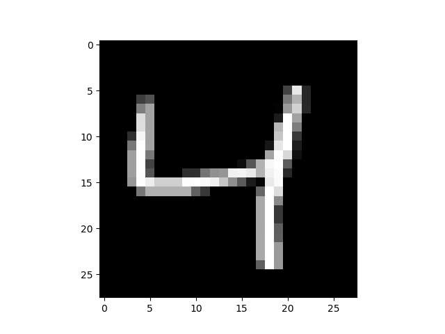
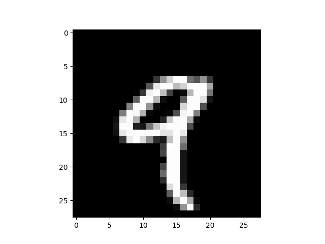
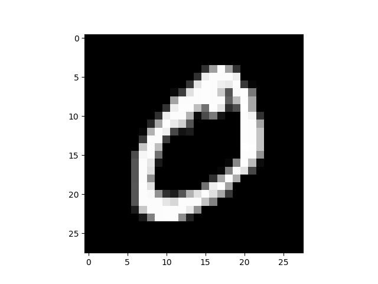
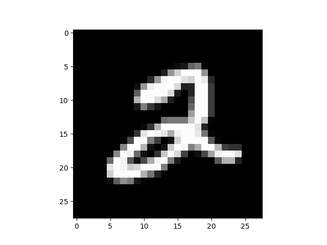
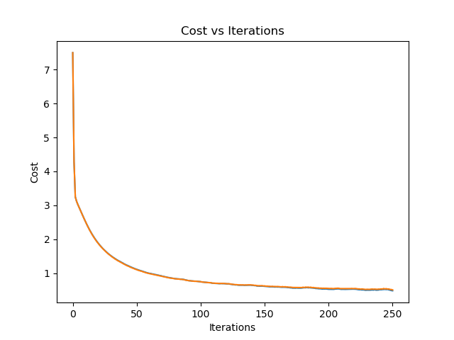

# machinelearnlib

[](https://pypi.org/project/machinelearnlib/)
[](https://travis-ci.org/Kai-Bailey/machinelearnlib)


## Description

Machinelearnlib is a python package that allows user to run different machine learning algorithms. It is designed to be a high level library so users can quickly test different models on their data to find which one works the best. It also provides various helper functions for importing data, feature scaling and plotting results. The project was motivated by my desire to learn more about data science and machine learning.

## How to run

Install the library with:

```python
pip install machinelearnlib
```

To use machinelearnlib you must first define the parameters for the model and training data using the model class. The following example will train a neural network on the MNIST data set. Training this model with the following parameters will results in around 94% accuracy on the training and test sets.
After training the model several examples of hand written digits will be displayed along with models prediction. Finally, a graph showing the cost vs iterations will be displayed.

<p align="center">
    
<p/>
<p align="center">
 
<p/>

```python
# Can choose from linearRegression, logisticRegression and neuralNet
model = "neuralNet"

# Training data
# The files containing the training data should be placed in a data folder and the 
# names of the files should be specified below. Features are are arranged so each row is a
# training example and each feature is a column. Labels should be stored as a single column.
trainDataFileName = "MNIST"
testDataFileName = "MNIST" 

# Format of the training data
# Valid options are csv, matlab or nparray (numpy array)
fileFormat = "nparray"

# Setting featureScaling to True will shuffle the training data, and perform standard deviation 
# and mean normalization.
featureScaling = False

# Hyperparameters
learningRate = 0.3
regularization = 0.0001
randInitRange = 0.1

# Number of iterations to run the learning algorithm for.
iterations = 250

# If the model used is a neural net you can specify the number of nodes in each layer using a list.
# For example a neural network with an input layer of size 10, hidden layer 12 and output layer of 8
# would use [10, 12, 8]. The input layer must be the same size as the number of features (columns) in
# the training data. If you are not using a neural net the list can be left empty.
netArchitechture = [784, 100, 10]
```

Then, simply import the machinelearnlib and run the model:

```python
from machinelearnlib import machinelearnlib as ml

mlModel = ml.Model(model, 
                trainDataFileName, 
                fileFormat, 
                netArchitecture=netArchitechture,
                learningRate=learningRate, 
                regularization=regularization, 
                iterations=iterations,
                randInitRange=randInitRange,
                featureScaling= featureScaling)

ml.train(mlModel)
```

## Design Principles
Machinelearnlib follows two main design principles. 

The first is a central process list which defines the order in which each function will be called. Functions can be dynamically added and removed from this process list during runtime. This allows user defined options such as shuffle data and feature scaling to easily be added.  

The second design principle is a plugin approach to models. Each model is defined by its process list located in loadModel.py and the functions specific to that model defined in its respective script in the models folder. Models are dynamically added during runtime so it easy to add new models without changing any existing code. Furthermore, each model can draw from communal functions located in machinelearnlib folder allowing for code reuse.


## Data Formatting
Training data must formatted so that each column contains a feature and each row is a training example. The test data must be stored as a single column.

|  | feature 1 | feature 2 | feature 3 |
|----------|----------|----------|--------|
| datapoint 1 |  |  |
| datapoint 2 |  |  |
| datapoint 3 |  |  |
| datapoint 4 |  |  |    


## Author
* [Kai Bailey](https://kai-bailey.com) - Software engineering student at the University of Alberta.


## Acknowledgment
Example Data From:

* [Linear Data Set](https://www.kaggle.com/andonians/random-linear-regression)
* [Iris Data Set](https://archive.ics.uci.edu/ml/datasets/iris)
* [MNIST Data Set](http://yann.lecun.com/exdb/mnist/)

Thanks to [Coursera](https://www.coursera.org/learn/machine-learning/home/welcome) for the free course!
